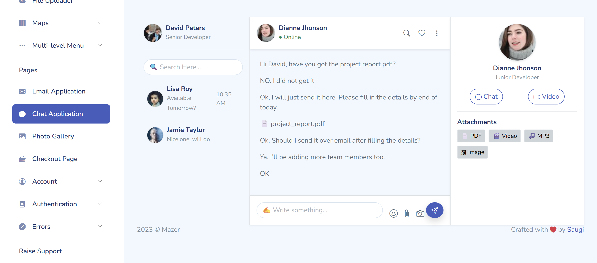
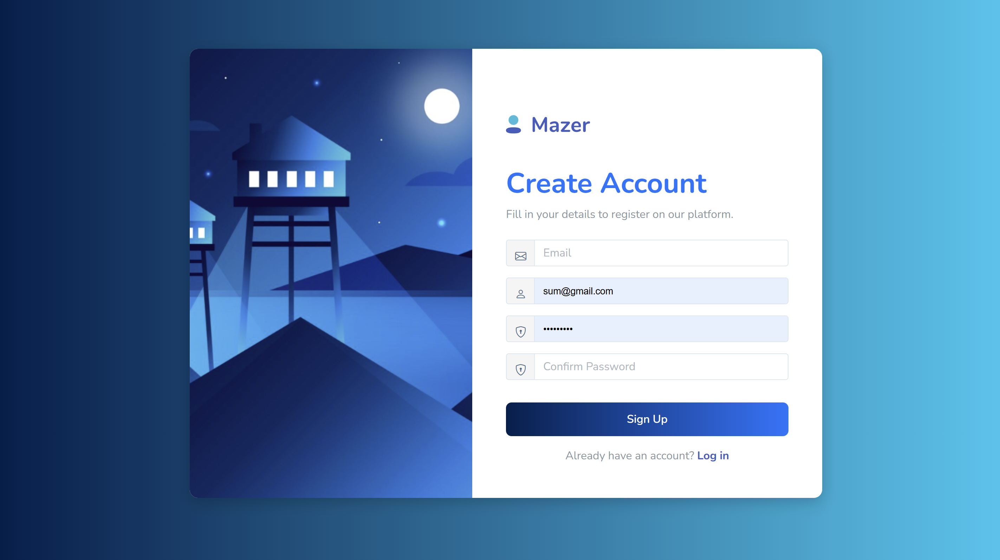
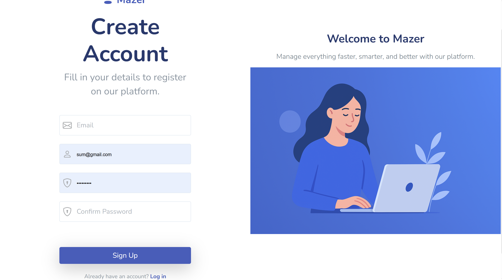
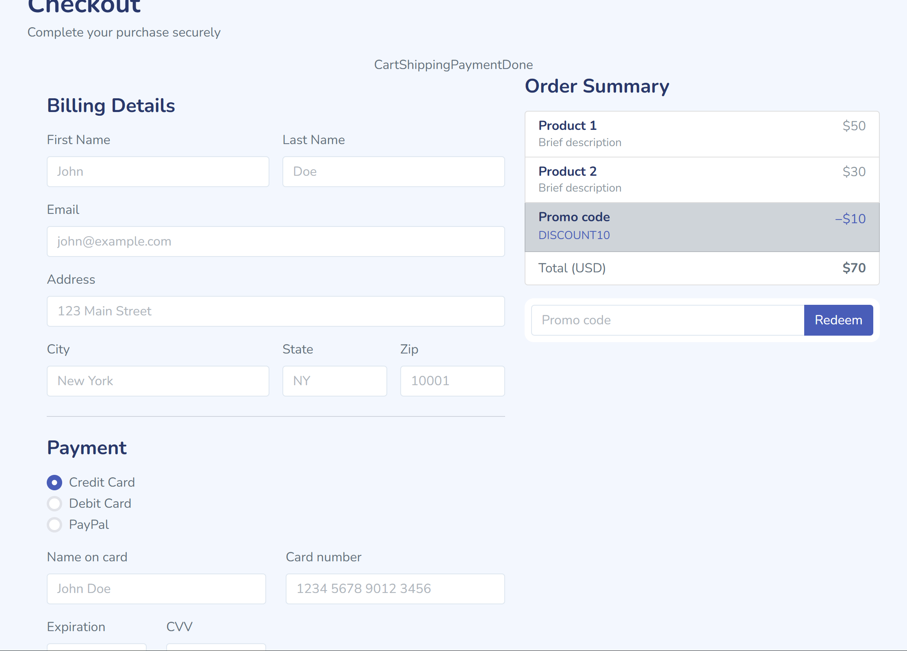

# 💬 Modern Chat Application UI

This is a **responsive Chat Application UI** built with **Bootstrap 5** and **HTML/Nunjucks**.  
The design uses **navy-blue & white theme**, **glassmorphism sidebars**, and **modern chat bubbles** with smooth animations.  
It’s a front-end only project (no backend) – useful for portfolios and demonstrating UI/UX skills. 🚀  

---

## 📸 Screenshot



*(Put your PNG screenshot in the `docs/` folder and rename it `screenshot.png` so GitHub can render it.)*

---

## 🛠 Features
- 📱 Responsive layout with **three panels**:  
  - **Sidebar (Contacts List)**  
  - **Chat Window (Messages)**  
  - **User Info (Profile & Attachments)**  
- 🎨 **Modern navy-blue gradient theme**  
- 🧊 **Glassmorphism side panels** with blur effects  
- 💬 **Chat bubbles** styled for sender & receiver  
- 📎 Attachment & file preview support  
- 🖼 Avatar images with online status indicators  
- ⚡ Interactive hover & active states  

---

## 📂 Project Structure

project/
├── src/
│ ├── layouts/
│ │ └── master.html # Base layout (Nunjucks)
│ ├── application-chat.html # Chat UI page
│ └── assets/ # Static assets (icons, CSS, etc.)
├── docs/
│ └── screenshot.png # Screenshot for README
├── package.json
├── vite.config.js
└── README.md

markdown
Copy code

---

## 🧩 How It Works (Logic)

- The **chat screen** is divided into 3 sections using **Bootstrap grid + Flexbox**.  
- **Messages** are styled with different background colors and border radius depending on:  
  - **Sent Message** → Blue gradient bubble, right aligned  
  - **Received Message** → White/grey bubble, left aligned  
- **Sidebars** use `backdrop-filter: blur(10px)` to create a **glass effect**.  
- **Hover effects** highlight the active contact in the sidebar.  
- **Icons (Bootstrap Icons)** are used for search, emoji, camera, and send buttons.  
- The **send button** is a floating **circle button with shadow**.  

---


# Authentication Pages Refactor

This document describes the refactor of the **authentication templates** in the project.  
The changes focus on improving **user experience**, **clarity of purpose**, and **modern design practices**.

---

## 🔹 Objective
The initial template was designed for **Login** only.  
The new refactor introduces a dedicated **Register Page**, with cleaner structure, extended input fields, and improved UI/UX to support onboarding.

---

## 🔹 Key Changes

### 1. Page Title & Context
- **Before**: `Login`  
- **After**: `Register`

➡️ Updated to reflect the new user journey: **account creation** instead of **authentication**.

---

### 2. Layout Simplification
- **Old (Login)**: Two-column grid (`auth-left` + `auth-right`)  
- **New (Register)**: Minimal container with `login-left` (illustration) and `login-right` (form)  

➡️ Cleaner structure makes the **sign-up form the focal point**.

---

### 3. Headings & Subtext
- **Old**:  
  ```html
  <h1 class="auth-title">Log in.</h1>
  <p class="auth-subtitle">Log in with your data that you entered during registration.</p>

    New:

    <h1>Create Account</h1>
    <p class="text-muted">Fill in your details to register on our platform.</p>

➡️ Messaging updated for onboarding clarity.
4. Form Fields

    Login Form

        Username

        Password

        “Keep me logged in” checkbox

    Register Form

        Email

        Username

        Password

        Confirm Password

➡️ Expanded inputs ensure all necessary data for new account creation is collected.
5. Actions & Links

    Old: “Don’t have an account? Sign up” + “Forgot password?”

    New: “Already have an account? Log in”

➡️ Clearer call-to-action flow between Login ↔ Register.
6. Visual Enhancements

    Larger, centered logo for stronger branding.

    btn btn-custom for consistent brand identity.

    Cleaner spacing and typography for professional look.

    Left column reserved for illustration/banner (modern web convention).

🔹 Outcome

    Separated Login and Register into distinct, purpose-driven templates.

    Improved UX/UI consistency and readability.

    Made the onboarding process more intuitive and recruiter-ready.

📸 (Optional Screenshots)

   

✅ Skills Demonstrated

    Template refactoring (Nunjucks + Bootstrap)

    Responsive design principles

    Semantic HTML and accessibility considerations

    UI/UX improvements for onboarding flows


# Register Page Refactor

This document highlights the improvements made to the **Register Page** template.  
The old code is preserved in comments for comparison, while the new implementation introduces a more professional and modern layout.

---

## 🔹 What Changed?

### 1. Layout Structure
- **Before (Commented Code)**  
  - Used a **two-column Bootstrap grid** with `auth-left` for form and `auth-right` for an image.  
  - Banner image was simply placed in the right column.

- **After (Active Code)**  
  - Split layout into **two balanced halves** (`col-lg-6` each).  
  - Left side → Form centered both vertically and horizontally.  
  - Right side → Welcoming text + illustration with better scaling.  

➡️ Improves **responsiveness** and ensures the design feels modern across all screen sizes.

---

### 2. Branding & Logo
- **Before**:  
  - Logo was small and aligned to the left.  

- **After**:  
  - Logo is **centered**, larger, and responsive (`max-width: 120px`).  
  - Strengthens branding and improves first impression.  

---

### 3. Headings & Subtext
- **Before**:
  ```html
  <h1 class="auth-title">Sign Up</h1>
  <p class="auth-subtitle mb-5">Input your data to register to our website.</p>

    After:

    <h1 class="auth-title text-center mb-2">Create Account</h1>
    <p class="auth-subtitle text-center mb-5 text-muted">Fill in your details to register on our platform.</p>

➡️ Clearer, user-friendly messaging with centered alignment for readability.
4. Form Enhancements

    Same fields kept: Email, Username, Password, Confirm Password.

    UI Improvements:

        Larger input fields (form-control-xl).

        Icon placement optimized with form-control-icon.

        Consistent spacing (mb-4).

➡️ Makes the form cleaner and easier to use.
5. Call-to-Action

    Before:

        Simple "Already have an account? Log in" text under the form.

    After:

        Cleaner typography (fw-bold text-decoration-none).

        Reduced spacing for a tighter, more professional look.

➡️ Provides a clear navigation path between Register and Login.
6. Right-Side Banner

    Before:

        Contained only an image.

    After:

        Added a welcome headline and subtext above the image:

        <h2 class="fw-bold">Welcome to Mazer</h2>
        <p class="lead mt-3">Manage everything faster, smarter, and better with our platform.</p>

        Image scaled with max-height: 80% and object-fit: contain.

➡️ Turns the right column into a marketing space rather than just decoration.
🔹 Outcome

    Transitioned from a basic Sign Up page to a polished, recruiter-ready Register template.

    Better use of space, typography, and visual hierarchy.

    Balanced form usability with branding and marketing elements.

✅ Skills Demonstrated

    Nunjucks template refactoring

    Bootstrap 5 responsive grid system

    UI/UX improvements for onboarding flows

    Semantic HTML and accessibility practices

📸 After change 

 


# 🛒 Checkout Page – Refactored with Nunjucks & Bootstrap

This project demonstrates a modern, production-ready Checkout Page built using Nunjucks templating + Bootstrap.

The page has been refactored from a simple “Coming Soon” placeholder into a fully functional, interactive checkout experience with:
✅ Billing & payment form
✅ Order summary with discounts & promo codes
✅ Progress tracker (Cart → Shipping → Payment → Done)
✅ Modern UI with animations & responsive design

🔄 Refactor Overview

The previous version was only a static placeholder card with a “Coming Soon!” message.
Now, it’s transformed into a complete checkout experience.

🎨 UI/UX Enhancements
✅ 1. Progress Tracker

Displays checkout flow steps: Cart → Shipping → Payment → Done

Highlights active step with bold colors and subtle animation.

✅ 2. Billing Form

Collects user details (name, email, address, city, state, zip).

Payment method selection (Credit, Debit, PayPal).

Card details with input validation and placeholders.

✅ 3. Order Summary

Lists products with descriptions & prices.

Shows applied promo code with discount.

Displays grand total clearly.

✅ 4. Styling

Modern card layout with rounded corners & shadows.

Gradient buttons with hover states.

Focus styles on form fields for accessibility.

Responsive design with Bootstrap grid.

✅ 5. Animations (Animate.css)

Smooth entrance effects (fadeIn, fadeInLeft, fadeInRight).

Pulse animation on the Place Order button for call-to-action emphasis.

📂 Tech Stack

Nunjucks (templating engine)

Bootstrap 5 (layout & components)

Animate.css (subtle UI animations)

✨ Final Result

A fully functional, recruiter-ready checkout page.

Demonstrates frontend development + UX design skills.

Can be reused in any e-commerce or SaaS application.

📸 Visual Preview


👨‍💻 Author
Built with ❤️ by    PRIYANSU PRIYAJYOTI JENA
